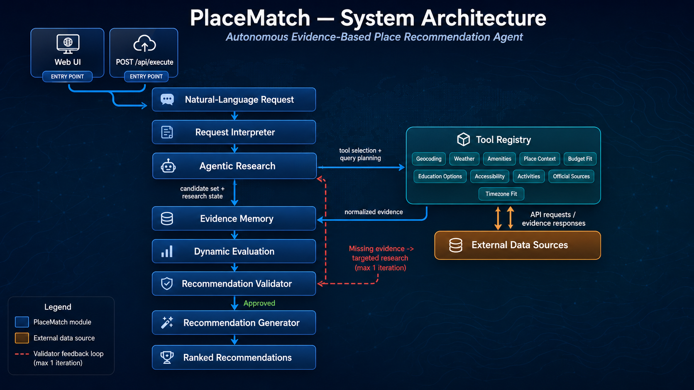

# DigitalNomadAgent — Autonomous Evidence-Based Place Recommendation Agent

An autonomous AI agent that recommends cities, regions, or destinations from unrestricted
natural-language requests: remote work, studies, vacation, temporary relocation, or any mix of these.

---

**Vercel:** `https://digitalnomadagent.vercel.app/` · **GitHub:**
`https://github.com/edanperetz2/DigitalNomadAgent` · **Deadline:** 23 August 2026 · **Budget:**
$13/group (`MAX_PROJECT_BUDGET_USD` in `.env.example`)

---

## What it does

Given a prompt like *"I want to spend three months somewhere in Europe where I can work remotely,
live without a car, and stay within €1,800 per month,"* the agent extracts hard constraints (budget
scoped to what it actually covers — accommodation-only vs. total living cost — plus things like
car-free) and soft preferences, then:

1. **Recall** — one LLM call proposes up to 30 broad candidates.
2. **Filter** — a zero-LLM deterministic pass (geocoding, region, budget ranking) narrows to 8 finalists.
3. **Research** — the agent decides *which* tools are relevant to this request, not a fixed list
   (`ARCHITECTURE.md` §3), and gathers evidence from open data sources.
4. **Score** — climate/work-infra/timezone/student-life/safety deterministically; cost/transport/
   accessibility/activities via one batched LLM call.
5. **Validate and answer** — a ranked, source-cited Markdown recommendation.

Supports remote work, study/exchange, vacation, relocation, and mixed-purpose requests. Which tools
run, how criteria are weighted, and whether an extra research round happens are all decided
dynamically per request — an off-topic request is declined before research starts, not force-fit
into an answer. Full explanation: `ARCHITECTURE.md`.

---

## Architecture overview



Also served at `GET /api/model_architecture`, generated by `scripts/render_architecture.py` straight
from `app/core/module_names.py` — same names in the code, the diagram, `/api/agent_info`, and LLM
tracing, by construction. Full explanation: `ARCHITECTURE.md`.

---

## Required API endpoints (exact contracts)

### `GET /api/team_info` — real response

```json
{
  "group_batch_order_number": "2_4",
  "team_name": "Shani, Idan & Ilay",
  "students": [
    {"name": "Idan Peretz", "email": "edanp@campus.technion.ac.il"},
    {"name": "Shani Goren", "email": "shanigoren@campus.technion.ac.il"},
    {"name": "Ilay Braunshtein", "email": "bilay@campus.technion.ac.il"}
  ]
}
```

### `GET /api/agent_info`

Shape: `{"description", "purpose", "prompt_template", "prompt_examples": [{"prompt", "full_response",
"steps"}]}`. `prompt_examples` are **real answers** from live runs (`assets/prompt_examples.json`),
not fabricated — see the live endpoint for actual content.

### `GET /api/model_architecture`

Raw PNG bytes, `Content-Type: image/png` — not JSON, not Base64. Generated from code
(`tests/unit/test_architecture_png_file.py` fails if they drift).

### `POST /api/execute`

```json
{"prompt": "I want to spend three months somewhere in Europe where I can work remotely, live without a car, and stay within €1,800 per month."}
```

Always exactly 4 top-level fields, success or error, never FastAPI's default `{"detail": [...]}`:

```json
{"status": "ok", "error": null, "response": "## Brief interpretation\n...", "steps": [{"module": "Request Interpreter", "prompt": {}, "response": {}}]}
{"status": "error", "error": "The prompt cannot be empty.", "response": null, "steps": []}
```

Hard deadline **270s** (research stops at 210s; 60s left to score/generate), inside the course's
300s Vercel ceiling — every fallback is disclosed, never a raw error or hang. The body is always
exactly `{"prompt": "..."}`, including for automated grading — always one final recommendation,
never a mid-way clarifying question (it becomes a disclosed assumption instead). Exception: the
deployed frontend adds an `X-Interactive-Mode: true` header to restore real clarification for a
human at the keyboard.

`DELETE /api/history` / `POST /api/history/delete` are additive UI-only endpoints, not part of the
4 required ones.

---

## UI

`GET /` — vanilla HTML/CSS/JS (no framework), calls `POST /api/execute` only, no duplicated agent
logic. Loading state shows an elapsed timer + a "still thinking" note after 15s (real requests take
40-110+s); the browser aborts at 295s behind the backend's 270s deadline. Each place shows a **Fit
Score** (reference only) and **Evidence Coverage**; `[N]` citations link to their source. A
clarification question (interactive mode) shows an inline reply box instead of a dead end, capped at
2 questions per thread before resolving non-interactively. Sidebar history is multi-selectable,
clearable, collapsible/resizable (persisted via `localStorage`).

---

## Setup (Windows PowerShell)

```powershell
python -m venv .venv
.venv\Scripts\Activate.ps1
python -m pip install --upgrade pip
pip install -r requirements.txt
copy .env.example .env
pytest -q
ruff check .
uvicorn app.main:app --reload
```

Open `http://127.0.0.1:8000/`, or:

```powershell
Invoke-RestMethod http://127.0.0.1:8000/api/team_info
Invoke-RestMethod -Method Post -Uri http://127.0.0.1:8000/api/execute `
    -ContentType "application/json" `
    -Body (@{prompt = "Find a quiet beach destination for two weeks in October."} | ConvertTo-Json)
```

Startup validates `config/team_info.json` and, if `MOCK_LLM=false`, `LLMOD_API_KEY`/`LLMOD_MODEL`
presence and `LLMOD_BASE_URL` syntax — never a paid request at startup.

---

## Environment variables

All documented with safe defaults in `.env.example`. The ones worth knowing:

| Variable | Purpose |
|---|---|
| `MOCK_LLM` | `true` by default — zero-cost, deterministic `MockLLMClient` |
| `LLMOD_API_KEY`, `LLMOD_MODEL` | Real credentials, required only when `MOCK_LLM=false` |
| `MAX_PROJECT_BUDGET_USD` | Local hard cap, default `13` (the course budget) |
| `MAX_LLM_CALLS_PER_REQUEST` | Default `4` |
| `LLM_MAX_OUTPUT_TOKENS` | Default `12000` — too low truncates real output mid-JSON |
| `MAX_BULK_CANDIDATES` / `MAX_FINALISTS` / `MAX_FINAL_RECOMMENDATIONS` | `30` recall → `8` researched → `8` presented |
| `AGENT_EXECUTION_TIMEOUT_SECONDS` | Backend deadline; default and maximum `270`s |
| `RECOMMENDATION_RESERVE_SECONDS` / `TOOL_EXECUTION_TIMEOUT_SECONDS` | `60`s / `50`s |

Everything else (provider request shape, cost-estimation rates, concurrency, infra paths) is in
`.env.example` with inline comments. **Never commit the real `.env`** — already gitignored.

**LLMod.ai**: `app/llm/llmod.py` assumes an OpenAI-compatible chat-completions shape; if the course's
differs, only that file changes. Re-register with the course-required email *before* requesting the
key. `scripts/check_llmod_connection.py` sends one real request to verify config — **consumes real
credit, never run automatically**.

**Golden set** (`scripts/golden_set/`): one fixed prompt per purpose plus edge cases (ambiguous,
unaffordable budget, excluded region, car-free), scored on structural properties, not exact text.
Also runs as a pytest case (`tests/integration/test_golden_set_harness.py`).

```powershell
python scripts/run_golden_set.py          # MockLLMClient, $0
python scripts/run_golden_set.py --real   # Real provider, consumes credit
```

---

## Budget control

Every LLM call is recorded (SQLite `llm_usage`) with tokens and either provider-reported cost or a
flagged (`is_estimated=True`) conservative estimate. `BudgetManager` refuses a call *before* it's
made if the worst-case cost would exceed `MAX_PROJECT_BUDGET_USD`, or the per-request call cap is
hit. **The provider-side account limit is authoritative** — this local ledger is an additional
safeguard, not a substitute; the project never claims to know the official LLMod.ai balance, only a
locally estimated one, always labeled as such.

## Data sources and cache

**Live**: OpenStreetMap Nominatim/Overpass, Open-Meteo, Wikivoyage, GOV.UK, World Bank, Wikipedia
(internet-speed data), WhereNext (city prices), Frankfurter (currency). **Local**: a static
language-coverage reference, plus offline fakes for tests. All outbound calls go through an explicit
domain allow-list with SSRF protection (`app/core/security.py`) — no generic URL-fetch tool exists.

SQLite-backed (`tool_cache`), cache-first, with per-source TTLs (`app/evidence/cache.py`): geocoding
and climate data cached long (30 days/1 year), amenities/mobility medium (2 weeks), safety/exchange
rates/weather short (1 day). A live-call failure falls back to expired cache, explicitly marked
`stale=True` — never presented as current.

---

## Testing

```powershell
pytest -q
ruff check .
```

Offline suite runs on `MockLLMClient` + deterministic fake tools (zero cost, zero network — an
autouse fixture fails any test that tries a real HTTP call). Live tests (`tests/live/`) are skipped
unless `RUN_LIVE_TESTS=1` and `MOCK_LLM=false` — don't enable casually. Layout: `tests/unit/`
(schemas, state machine, tools, scoring, budget, security) and `tests/integration/` (endpoints,
contracts, agent autonomy, UI).

---

## Deployment

The course requires **Vercel** specifically (`docs/Project instructions.pdf`) — that's the only
deployment path this project uses. `vercel.json` configures: `main.py`'s `app` as the entrypoint
(Vercel auto-detects it, no wrapper needed); `routes` sending every path to it;
`functions.main.py.maxDuration: 300` (our `270`s deadline fits with margin); `env.MOCK_LLM: "false"`
(the real provider is graded) and `SQLITE_PATH=/tmp/...` (Vercel's filesystem is read-only except
`/tmp`, which resets every cold start — see "Storage" below).

**Budget ceiling**: the number that binds is the **account**-level cap, not the key — `GET
/user/info` reports `max_budget: 13.0`, `GET /key/info` reports `null`. Verify with
`python scripts/probe_llmod_account.py` (read-only, $0).

**To deploy**: connect this repo on vercel.com → Add New Project, set `LLMOD_API_KEY`/`LLMOD_MODEL`
in the dashboard (never committed) — everything else is already in `vercel.json`. Keep the account
active until graded.

An opt-in live SLA check (3 prompts, targets p95 < 240s) exists for pre-deploy verification:

```powershell
$env:RUN_LIVE_TESTS="1"; $env:MOCK_LLM="false"; pytest -q -m live
```

---

## Storage: a stated deviation from the brief

The brief names **Supabase** (database) and **Pinecone** (vectors). This project uses neither — SQLite
(`app/evidence/database.py`), no embeddings, no vector retrieval. Deliberate, not glossed over:

- None of the 4 required endpoints depend on persistence — 3 are file reads, `/api/execute` is
  stateless and single-shot. The database only holds two *optimizations*: the tool-evidence cache
  and the local budget ledger.
- Under Vercel that database lives in `/tmp` and resets every cold start, so the cache is
  best-effort and the ledger doesn't accumulate — the budget that actually binds is the
  provider-side account cap (see "Budget control").
- Retrieval is live, not vectorized: evidence comes from named APIs at request time with source URL
  and retrieval date on every claim. A vector store would add an indexing layer without making the
  answer more checkable.

Swapping to Supabase would make the cache/ledger persistent — the largest remaining gap against the
brief's letter, not attempted this close to the deadline in preference to leaving the 4 required
endpoints untouched.

## Known limitations

- Typed city prices cover 57 cities (third-party dataset); other cities get country-level context
  only, never a city estimate. Fixed-cost items aren't a complete personal budget.
- `TimezoneFitTool` covers a curated set of common origins; unmapped ones honestly report "overlap
  unknown" rather than guessing.
- `MockLLMClient`'s keyword interpreter and ~30-entry-per-purpose candidate pool are simplified
  offline stand-ins; real LLM output extracts richer nuance and isn't limited to a fixed set.
- Safety evidence (FCDO + World Bank/UNODC + Wikivoyage) requires ≥2 sources and is comparative,
  never a universal city-safety rating.

## Legal and ethical limitations

- Never claims live flight/hotel prices, guaranteed visa/admission/safety, or exact current
  costs/travel times — always directs the user to verify officially.
- External retrieved content is always treated as untrusted evidence, never instructions.
- No user data persisted beyond evidence caching and the local budget ledger; no personal
  information collected.
